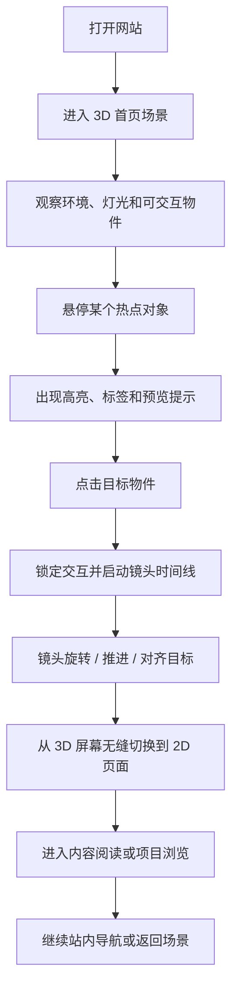

# MEO_Blog 概念设计方案

## 项目定位

`MEO_Blog` 不打算做成一个普通的个人博客首页，而是希望做成一个带有鲜明主机游戏气质的个人数字展厅：

- 第一层是具有空间感和品牌感的 `3D 场景`
- 第二层是稳定、清晰、适合阅读的 `2D 内容系统`
- 两层之间不是普通跳转，而是通过 `镜头运镜` 完成叙事式切换

你提供的参考图 [参考图.jpg](./参考图.jpg) 很有启发性，它说明了几个很重要的方向：

- 桌面式陈列构图很适合作为个人空间表达
- 居中主物件能够形成很强的视觉记忆点
- 实体静物和留白背景能让场景显得有秩序、有故事

本项目不会沿用复古办公桌和老式显示器的设定，而是把整体主题换成 `主机游戏收藏陈列台`，核心物件转为 `Switch`、`PlayStation`、手柄、卡带、光盘盒、奖杯、摆件、记忆卡等元素。

## 设计关键词

- 主机收藏
- 可探索空间
- 电影式过场
- 3D 进入 2D
- 硬件叙事
- 游戏系统感 UI
- 温暖灯光
- 收藏桌面

## 体验目标

这个网站希望让访问者感觉自己不是在“打开一个网页”，而是在“进入你的个人游戏空间”。

整个体验需要按顺序实现三层感受：

1. 识别感
   用户第一眼就能认出这是一个主机游戏主题的个人站点，而不是通用博客模板。
2. 探索感
   用户会注意到场景中的多个物件可以交互，进而产生点击和探索欲。
3. 沉浸感
   用户点击某个关键设备后，镜头开始运镜，最终自然切入一个真正适合阅读的 2D 内容页。

## 信息架构

整个网站应明确拆分为 `3D 入口世界` 和 `2D 内容世界`。

### 路由结构

- `/`
  3D 首页与入口场景
- `/posts`
  文章列表页
- `/posts/[slug]`
  文章详情页
- `/projects`
  项目库
- `/about`
  关于我与个人时间线
- `/lab`
  视觉实验、交互实验、原型展示
- `/archive`
  标签、年份、系列归档
- `/guestbook`
  留言、联系方式、社交入口

### 物件与内容映射

场景中的每个物件都不应只是摆设，而应承担导航和内容象征。

| 场景物件 | 站内含义 | 交互结果 |
| --- | --- | --- |
| 巨型 Switch 屏幕 | 博客主入口 | 镜头旋转并推进，进入 2D 首页或文章页 |
| 左 Joy-Con | 年份归档 | 拉出式面板或直接跳转归档页 |
| 右 Joy-Con | 标签与分类 | 打开筛选或模式切换 |
| PlayStation 主机区域 | 项目与技术作品 | 镜头侧移并进入 `/projects` |
| 卡带架 | 精选文章或系列内容 | 悬停预览文章封面，点击进入专题 |
| 光盘盒 | 长文专题或作品集 | 打开一组主题内容 |
| 手柄 | Lab / 实验内容 | 进入更偏交互和视觉实验的页面 |
| 奖杯、手办、摆件 | About / 成长经历 / 里程碑 | 打开个人简介与时间线 |
| 记忆卡或存档图标 | Guestbook / Contact | 进入留言和联系入口 |

## 核心用户流程



## 首页场景概念

### 整体世界观

首页应该像是一个摆放在私人房间或创作空间中的主机收藏桌台：

- 中央是一台放大的 `Switch`，作为视觉核心和主要传送门
- 一侧是 `PlayStation` 风格主机或底座，作为项目入口
- 周围点缀若干承载内容意义的小物件
- 整个空间要像一个属于你的收藏区域，而不是商业电商展示页

### 空间气质

整体氛围建议是：

- 有收藏感，但不杂乱
- 有灯光氛围，但不过度赛博朋克
- 有游戏硬件质感，但仍然适合承载文字与个人内容
- 像私人房间里的展示桌，而不是商店柜台

### 视觉方向

不建议走太常见的“紫色霓虹赛博风”，因为容易变成没有辨识度的通用酷炫模板。

更适合你的配色可以是：

- 基础色：炭黑、石墨灰、米白塑料壳
- 点缀色 1：Switch 红橙
- 点缀色 2：PlayStation 深蓝
- 点缀色 3：荧光青绿或浅电光绿
- 灯光：暖色桌面主光 + 冷色边缘轮廓光

这种组合既有主机收藏的感觉，也能兼顾高级感和耐看度。

## 场景草图说明

下面的构图思路继承了参考图的“桌面陈列 + 中央主物件”逻辑，但会把主题完全替换成主机游戏世界。

```text
正视图概念

 ---------------------------------------------------------------
| 氛围灯墙面        装饰海报        奖杯 / 手办展示层            |
|                                                               |
|      PS 主机区域            中央巨型 Switch + Dock            |
|                            主屏幕作为博客入口                |
|                                                               |
|      卡带架                 亚克力支架 + 光盘盒               |
|                                                               |
|      手柄                   掌机 / 小装置      存档图标        |
|                                                               |
 ---------------------------------------------------------------
                    观众 / 摄像机初始观看位置
```

```text
俯视图概念

 -----------------------------------------------------------------
| 墙面灯带 / 收藏摆件 / 游戏封面装饰 / 层架                        |
|                                                                 |
| [PS 区域]         [Switch 主角区]          [卡带 / 光盘区]       |
| 项目内容          博客主入口                精选文章与专题        |
|                                                                 |
| [手柄区域]        [互动桌面中心]            [存档 / 联系区]       |
| Lab 内容          Hover 提示与聚焦区        留言与联系            |
 -----------------------------------------------------------------
```

### 场景构图规则

- Switch 必须位于视觉中央，因为它承担了最关键的进入动作
- PlayStation 区域需要足够醒目，但不能抢走主入口焦点
- 小物件必须轮廓清楚，避免为了“丰富”而堆得过满
- 每个可点击物件都要有合理的落位，让场景看上去真实可信

## 首页分镜脚本

首页最好像一个带分支的短篇过场动画。

### Sequence 0: Arrival

- 时长：`0s - 2s`
- 镜头：固定广角，带轻微呼吸漂浮
- 画面：整张收藏桌、主机、灯光和屏幕反光同时进入视野
- 目的：建立世界、尺度和中心物件

### Sequence 1: Discovery

- 时长：`2s - 8s`
- 镜头：跟随鼠标的轻微视差，不做大幅移动
- 画面：热点物件出现非常克制的发光或提示
- 目的：告诉用户这个场景是可以互动的

### Sequence 2: Hover Feedback

- 触发：悬停某个物件
- 镜头：向目标做很轻的聚焦偏移
- 效果：边缘光、标签、简短预览、微弱 Bloom
- 目的：增强点击信心，不用大段文字教学

### Sequence 3: Click and Lock

- 触发：点击 Switch 屏幕
- 镜头：用户控制失效，主时间线启动
- 效果：屏幕亮度提高，其他物件降亮度，环境音变轻
- 目的：让点击动作显得郑重而有仪式感

### Sequence 4: Orbit Reveal

- 时长：约 `1.5s - 2.5s`
- 镜头：围绕 Switch 旋转 `180` 到 `300` 度
- 运动风格：平滑、沉稳、有重量感，不要太像游戏菜单乱飞
- 目的：建立网站专属的标志性运镜体验

### Sequence 5: Screen Alignment

- 时长：约 `0.8s`
- 镜头：对准屏幕正前方并停稳
- 效果：屏幕内容变得清晰，边框逐渐充满视口
- 目的：为 3D 到 2D 的接管做准备

### Sequence 6: Portal Transition

- 时长：约 `0.4s - 0.8s`
- 镜头：向屏幕平面内推进
- 效果：扫描线淡出、Bloom 清洗、屏幕玻璃反光擦除、DOM 内容淡入
- 目的：隐藏 Canvas 和页面系统之间的技术接缝

### Sequence 7: 2D Reading Layer

- 结果：进入一个平静、可读、结构清楚的 2D 页面
- 状态：让 3D 魔法退到背景，把阅读体验交还给内容
- 目的：真正完成从“吸引进入”到“留住阅读”的转换

## 2D 内容层设计

2D 页面需要延续同一世界观，但必须明显比 3D 场景更安静、更可读。

### 视觉连续性

- 使用和 3D 场景一致的强调色
- 延续主机 UI 的几何边框和模块感
- 按钮、卡片、标签可以保留一点硬件界面气质

### 阅读优先级

- 正文宽度舒适
- 标题、摘要、正文有明显层级
- 代码块风格清楚
- 目录导航明确
- 上一篇 / 下一篇切换自然

### 推荐的文章页结构

- 标题区：日期、分类、标题、摘要
- 阅读进度条
- 目录或侧边导航
- 正文内容区
- 嵌入媒体区：截图、图表、视频、示意图
- 相关文章区：用卡带或游戏封面感卡片来呈现

## 功能设计

### 1. 内容系统

- 使用 MDX 管理文章
- 支持标签、专题、系列、精选
- 支持项目页单独维护媒体与技术栈
- 支持归档和搜索

### 2. 3D 交互系统

- 首页场景渲染
- 热点映射
- 悬停反馈
- 镜头路径控制
- 3D 到 2D 的切换控制
- 可选的返回场景机制

### 3. 个人身份系统

- About 页面可以像“玩家资料页”
- 时间线可以设计成“游戏库解锁记录”或“存档日志”
- 技能点可以像装备栏、模块栏或已解锁能力

### 4. 实验区

- Shader 实验
- 小型交互原型
- 一次性的视觉文章
- 声音和动画测试

### 5. 社交与联系层

- 留言板
- 邮箱与社交链接
- Newsletter 或订阅入口
- 简历与外部平台链接

## 动效语言

这个网站的动效不能只是“有动效”，而是要有一种被编排过的导演感。

### 原则

- 起步慢，过程稳，收尾准
- 镜头运动要有重量感
- 悬停反馈克制，不要过度晃动
- 过场动效要服务于空间和叙事，而不是单纯炫技

### 推荐动效集

- 镜头待机漂浮
- 物件边缘脉冲高亮
- 标签滑入
- 点击后的聚焦与弱景深感
- 围绕主机的旋转运镜
- 屏幕接管时的反光擦除和内容淡入

## 音效设计

音效建议作为可选层，默认静音也成立，但如果后面加入，会很加分。

可以考虑：

- 很轻的房间环境音
- 选择物件时的机械按键声
- 进入屏幕时的柔和启动音
- 轻量 UI 确认提示声

原则是：

- 不强依赖声音
- 不自动惊扰用户
- 保持可关闭和可静音

## 响应式策略

这个网站必须按设备等级降级，而不是所有设备硬跑同一套重场景。

### Desktop

- 完整 3D 场景
- 完整镜头轨迹
- 更丰富的反光与辅助物件

### Tablet

- 简化物件密度
- 缩短运镜路径
- 适度减少后处理

### Mobile

- 压缩开场
- 降低模型复杂度
- 直接提供 `Skip Intro`
- 更快切入 2D 内容

## 技术方向

当前最合适的实现路径仍然是：

- `Next.js`
- `React Three Fiber`
- `@react-three/drei`
- `GSAP`
- `camera-controls`
- `MDX`
- `Blender`

### 这套方案适合的原因

- 可以清楚地分离 3D 表现层和 2D 内容层
- 文章页依然有较好的 SEO 和可读性
- 首页可以拥有很强的品牌辨识度
- 后续能继续增强镜头设计，而不至于一开始就把工程复杂度拉满

## 开发阶段建议

### Phase 1: 标志性入口

- 先完成一个高质量 3D 首页场景
- 先建好 Switch 主入口模型或替代资产
- 先完成 `4 - 6` 个可点击热点
- 打通第一次完整的 3D 进入 2D 过场
- 同时建立 posts、projects、about、archive 四个 2D 页面

### Phase 2: 世界扩展

- 增强 PlayStation 路线
- 增加更细的物件叙事
- 增强悬停预览和环境灯光
- 加入轻量音效与收藏细节

### Phase 3: 个人宇宙

- 加入季节状态或不同房间状态
- 增加彩蛋和隐藏互动
- 给精选文章和项目定制单独过场
- 加强从 2D 返回 3D 的回流体验

## 方案总结

最终这个概念可以被概括为一句话：

`一个以主机收藏桌面为舞台、以巨型 Switch 为入口、通过镜头运镜把用户从 3D 空间带入 2D 阅读世界的个人博客。`

这套方案保住了你最重要的创意核心：

- 真正的 3D 场景
- 有记忆点的摄像机过场
- 用硬件和收藏物件讲述个人风格
- 最终仍然回到一个可维护、可阅读、可长期生长的博客系统
